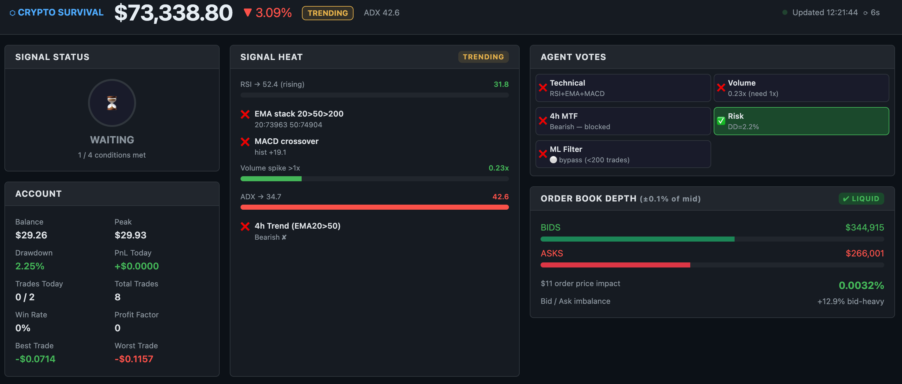
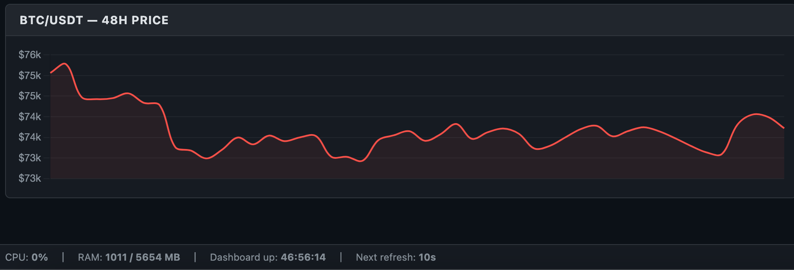

# Crypto Survival System

Algorithmic BTC/USDT trading bot — 4-agent consensus, regime detection, walk-forward backtesting, live on Oracle Cloud (KuCoin)

> **Live status:** Currently running in paper trading mode on Oracle Cloud (KuCoin)

---

## Screenshots


*Real-time dashboard — live price, regime detection, signal heat, agent votes, order book depth, and trade history*


*48-hour BTC/USDT price chart rendered live from KuCoin data*

---

## What It Does

The bot runs every minute, fetches live OHLCV data from KuCoin, detects the current market regime (trending vs ranging), and only enters a trade when all 4 agents agree on direction.

Paper trading mode simulates fills against live prices. Live trading mode executes real orders via the KuCoin API.

---

## Architecture

```
config.py            — All settings loaded from .env
agents.py            — 4-agent consensus: Technical, Sentiment, Risk, Execution
strategy.py          — ADX regime detection + ATR-based trade levels
backtest.py          — Walk-forward backtester (no lookahead bias)
optimize.py          — Optuna hyperparameter optimizer
bot.py               — Main loop, paper trading engine, DB logging, Telegram alerts
flask_dashboard.py   — Real-time web dashboard
ml_filter.py         — ML signal filter (activates after 200 trades)
```

---

## Regime Detection

Uses ADX to classify the market before applying any strategy logic:

- **ADX > threshold** → Trending → EMA stack + MACD crossover momentum strategy
- **ADX ≤ threshold** → Ranging → Bollinger Band mean reversion strategy
- Multi-timeframe confirmation: 1h signals must align with 4h EMA trend before entry

---

## 4-Agent Consensus Engine

A trade only executes when **all 4 agents agree**:

| Agent | Role | Blocks on |
|---|---|---|
| **Technical** | RSI, MACD, Bollinger Bands, EMA stack, volume spike filter | No clear signal, low volume, 4h trend mismatch |
| **Sentiment** | RSS headline keyword scoring | Feed errors return neutral (no veto) |
| **Risk** | Drawdown, daily loss, consecutive losses, ATR volatility gate | Any risk limit breach |
| **Execution** | Fee + slippage feasibility, minimum order size | Balance too low, execution unfeasible |

---

## ML Filter

Logistic regression filter trained on live trade history. Transparently bypassed until 200 trades accumulate, then automatically gates low-probability setups. Training triggered manually via `python bot.py --train-filter`.

---

## Walk-Forward Backtester

Proper out-of-sample validation — not curve-fitted to a single historical window:

- 1000-bar in-sample window, 200-bar out-of-sample test
- Steps forward 200 bars and repeats across the full dataset
- Reports Sharpe ratio, profit factor, win rate, and max drawdown per fold
- No lookahead bias — each fold only uses data available at that point in time

---

## Hyperparameter Optimizer

Optuna-based search across 6 strategy parameters:

- RSI thresholds (trend and range modes)
- ADX regime threshold
- ATR stop and target multipliers
- Volume spike minimum

Optimizes for Sharpe ratio across walk-forward folds. Run from a machine with Binance access (geo-restrictions apply on some cloud providers).

```bash
python optimize.py --trials 100 --metric sharpe
```

Results saved to `ops/best_params.json` with ready-to-paste `.env` lines.

---

## Backtest Results

| Metric | Value |
|---|---|
| Backtest period | 730 days (1h + 4h, BTC/USDT) |
| Optimization metric | Sharpe ratio |
| Best Sharpe (walk-forward, out-of-sample) | 0.27 |
| Validation method | Walk-forward (out-of-sample folds only) |

> Sharpe of 0.27 is an **out-of-sample** result from walk-forward validation — each fold was never seen by the optimizer, so this is a conservative, honest estimate rather than a curve-fitted in-sample number.

---

## Tech Stack

- **Language:** Python 3.9+
- **Exchange connectivity:** ccxt (KuCoin, Binance)
- **Data processing:** pandas, numpy
- **Backtesting / Optimization:** custom walk-forward engine, Optuna
- **ML:** scikit-learn (logistic regression)
- **Dashboard:** Flask + JavaScript
- **Database:** SQLite
- **Alerts:** Telegram Bot API
- **Deployment:** Oracle Cloud (Ubuntu), tmux

---

## Setup

**1. Clone and install dependencies**

```bash
git clone https://github.com/Katiehey/Crypto-Survival-System.git
cd crypto-survival-system
python3 -m venv .venv
source .venv/bin/activate
pip install -r requirements.txt
```

**2. Configure `.env`**

```
EXCHANGE=kucoin
KUCOIN_API_KEY=your_key
KUCOIN_API_SECRET=your_secret
KUCOIN_API_PASSPHRASE=your_passphrase
TRADING_MODE=paper
TELEGRAM_BOT_TOKEN=your_token
TELEGRAM_CHAT_ID=your_chat_id
```

**3. Run the bot**

```bash
python bot.py
```

**4. Run the dashboard**

```bash
python flask_dashboard.py
# Open http://localhost:5000
```

---

## Risk Management

| Parameter | Default | Meaning |
|---|---|---|
| `MAX_RISK_PER_TRADE` | `0.005` | 0.5% of balance per trade |
| `MAX_DAILY_LOSS` | `0.01` | 1% daily loss stops trading for the day |
| `MAX_DRAWDOWN_KILL_SWITCH` | `0.25` | 25% drawdown engages kill switch |
| `MAX_CONSECUTIVE_LOSSES` | `2` | Triggers cooldown period |
| `MAX_TRADES_PER_DAY` | `2` | Hard cap on daily trades |
| `ATR_STOP_MULT` | `1.98` | Stop loss distance in ATR units |
| `ATR_TARGET_MULT` | `2.23` | Take profit distance in ATR units |

---

## Deployment (Oracle Cloud)

The bot runs persistently on an Oracle Cloud free-tier VM with two tmux windows:

```bash
# Start both processes
tmux new-session -d -s crypto-survival-system -n bot && \
tmux send-keys -t crypto-survival-system:bot "source .venv/bin/activate && python bot.py" Enter && \
tmux new-window -t crypto-survival-system -n web && \
tmux send-keys -t crypto-survival-system:web "source .venv/bin/activate && python flask_dashboard.py" Enter

# Attach to bot logs
tmux attach -t crypto-survival-system:bot

# Detach without stopping
Ctrl+B then D
```

Telegram alerts are sent on every trade entry, exit, and kill switch event.

---

## Security Notes

- API keys are in `.env` — never commit this file (already in `.gitignore`)
- Enable **spot trading only** on your exchange API key — no futures, no withdrawals
- `TRADING_MODE=paper` by default — must be explicitly changed to `live`
